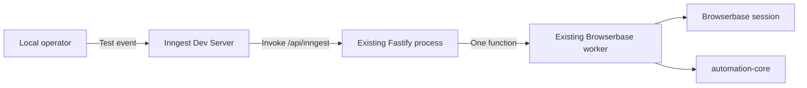

# Minimal local Inngest POC for Browserbase automation

## Status

Implemented POC. This integration is intentionally local-only and does not supersede
ADR 0005. The stateless `POST /v1/run` service remains the supported runtime while this
POC is evaluated.

If the POC is promoted to a durable or cloud-backed feature, write ADR 0006 before
adding production routes, credentials, or operational guarantees.

## Objective

Prove the smallest useful integration:

1. An operator sends one test event to the local Inngest Dev Server.
2. Inngest invokes one function registered on the existing Fastify process.
3. That function calls the existing `BrowserbaseAutomationWorker` once in its function
   attempt.
4. The Inngest UI shows whether the function completed or failed.

The POC succeeds when a complete schema 1.2 test workflow opens a Browserbase session,
runs through `@relay/automation-core`, releases the session, and reaches a terminal
state in the local Inngest UI.

## System boundary



There is one Inngest execution path. The existing synchronous `POST /v1/run` route
continues to exist unchanged for direct testing, but it is outside this POC flow.

## POC scope

Add only:

- The Inngest TypeScript SDK.
- One Inngest client with app ID `relay-browserbase-poc`.
- One function with ID `browserbase-automation-run`.
- The SDK-owned `/api/inngest` endpoint on the existing Fastify listener only when
  `INNGEST_DEV=1`.
- A small shared worker-execution helper so direct and Inngest runs use the same worker,
  active-run registry, timeout, capacity check, and shutdown cancellation.
- Focused unit and integration tests using fake workers. Normal tests must not create a
  paid Browserbase session.

Do not add:

- `POST /v1/runs` or a Relay status endpoint.
- Changes to either OpenAPI contract.
- Inngest Cloud, a public tunnel, or production deployment configuration.
- Inngest event, signing, API, or encryption keys.
- Scheduling, cancellation APIs, polling, callbacks, or a run database.
- Automatic retries, replay, idempotency, or exactly-once claims.
- Dual Inngest clients, encryption middleware, key rotation, or status mapping.
- Changes to FastAPI, PostgreSQL, or the Python persistence service.

## Event contract

Use one event name: `relay/automation.run.requested`.

```json
{
  "name": "relay/automation.run.requested",
  "data": {
    "workflow": {},
    "startStepId": "optional-step-id",
    "parameterValues": {
      "fill-step-id": "test value"
    }
  }
}
```

`workflow` is required. `startStepId` and `parameterValues` are optional and retain the
existing worker semantics. Unknown fields, a non-object workflow, an empty start step,
or non-string parameter values produce `invalid_event` without calling the worker. The
function does not define a second workflow validator or execution model.

The POC accepts only synthetic, non-sensitive workflows and parameter values. The local
Dev Server can display event payloads, so credentials, authenticated sessions, private
URLs, and real user data must not be used. End-to-end encryption is a prerequisite for
any future Cloud trial, not part of this local proof.

## Function behavior

Define one event-triggered function with:

- Trigger: `relay/automation.run.requested`.
- Retries: `0`.
- Concurrency: `1`.
- One `step.run("execute-browserbase-workflow", ...)` around the complete worker call.
- The existing worker run timeout as the execution deadline.

The function must:

1. Validate the event's top-level shape before provisioning Browserbase.
2. Acquire the same local capacity slot used by `POST /v1/run`.
3. Register an `AbortController` in the existing active-run registry.
4. Call `BrowserbaseAutomationWorker.run()` once.
5. Return only an allowlisted terminal value:

```json
{
  "status": "completed",
  "stage": "execution",
  "cleanupStatus": "completed"
}
```

For failures, include only an allowlisted code. Malformed events use `invalid_event`;
local admission failures use `at_capacity` or `shutting_down`; worker failures retain
their existing safe worker code. Do not return the workflow, parameters, worker event
stream, URLs, step payloads, Browserbase identifiers, connection URLs, or raw
exceptions.

No worker progress events are sent to Inngest in this POC. The Inngest UI shows only
function state and the safe terminal result.

`retries: 0` prevents deliberate application retries, but this POC does not promise
exactly-once browser side effects. Operators must inspect target state before manually
re-running a failed event.

## Existing service behavior

`POST /v1/run`, bearer authentication, NDJSON streaming, health routes, and the
package-local OpenAPI contract remain unchanged.

The Inngest Fastify adapter owns `/api/inngest` only when `INNGEST_DEV=1`; without that
exact value the route is absent. Any other non-empty value fails service configuration.
The opt-in also requires a loopback `AUTOMATION_HOST` because local development mode
does not verify Cloud signatures. The route is not added to the caller-facing OpenAPI
contract. General Fastify request and header logging remains disabled.

Shutdown uses the existing service lifecycle: readiness becomes unavailable, every
direct or Inngest worker is aborted, and Browserbase cleanup is allowed the configured
grace period.

## Local operation

### Requirements

- Node.js 24 or newer.
- The repository's existing package dependencies and builds.
- `BROWSERBASE_API_KEY` for the paid test session.
- No automation-service token; the loopback Fastify routes are intentionally
  unauthenticated for this local POC.
- Inngest Dev Server through `npx`; no Inngest account or key is required.

### Start the Fastify service

```bash
export BROWSERBASE_API_KEY="your-browserbase-api-key"
export AUTOMATION_HOST="127.0.0.1"
export INNGEST_DEV=1
npm run dev --prefix apps/automation-service-browserbase
```

### Start Inngest locally

In a second terminal:

```bash
npx inngest-cli@latest dev -u http://localhost:8080/api/inngest
```

Open the local Inngest UI, select `browserbase-automation-run`, choose **Invoke**, and
provide the event data from a synthetic schema 1.2 workflow. The Dev Server invokes the
function through the existing Fastify process.

## Minimal implementation shape

| Area | Change |
| --- | --- |
| `package.json` and lockfile | Add only the `inngest` runtime dependency. |
| `src/inngest.ts` | Create the client and a function factory that accepts the shared worker executor. |
| `src/app.ts` | Register the Fastify adapter and reuse the active-run lifecycle for the function. |
| Tests | Prove one event causes one fake worker call and returns only a safe outcome. |
| README and `.env.example` | Add the two local startup commands and opt-in `INNGEST_DEV=1`. |
| `NAVIGATION.md` | Identify the new function module after it exists. |

No Python files, migrations, root OpenAPI files, or package-local OpenAPI files change.

## Verification

Automated checks must prove:

- The function is registered at `/api/inngest`.
- Only `relay/automation.run.requested` triggers it.
- A valid event calls the fake worker once with the expected fields.
- Invalid event data does not call the worker.
- Function retries and concurrency are configured as specified.
- Worker failures produce only allowlisted terminal fields.
- Direct and Inngest runs share capacity and shutdown cancellation.
- Logs and returned values exclude sentinel workflow values, URLs, parameters, provider
  identifiers, connection URLs, and raw errors.

Run the existing TypeScript checks after the focused tests:

```bash
npm run typecheck --workspace @relay/automation-service-browserbase
npm test --workspace @relay/automation-service-browserbase
npm run build --workspace @relay/automation-service-browserbase
```

Perform one paid Browserbase smoke run manually only after fake-worker tests pass.

## Exit criteria and deferred production work

Stop after the local UI demonstrates one successful and one safe failed run. Do not
grow the POC into a production control plane during implementation.

A separate production design and ADR must decide:

- How callers submit events without exposing an Inngest event key.
- End-to-end payload encryption and key rotation.
- Cloud function registration and stable HTTPS connectivity.
- Durable status lookup and retention.
- Scheduling and cancellation semantics.
- Global concurrency and Browserbase account limits.
- Idempotency and duplicate-side-effect mitigation.

## References

- [Inngest local development](https://www.inngest.com/docs/local-development)
- [Serving Inngest functions with Fastify](https://www.inngest.com/docs/learn/serving-inngest-functions)
- [Sending events](https://www.inngest.com/docs/events)
